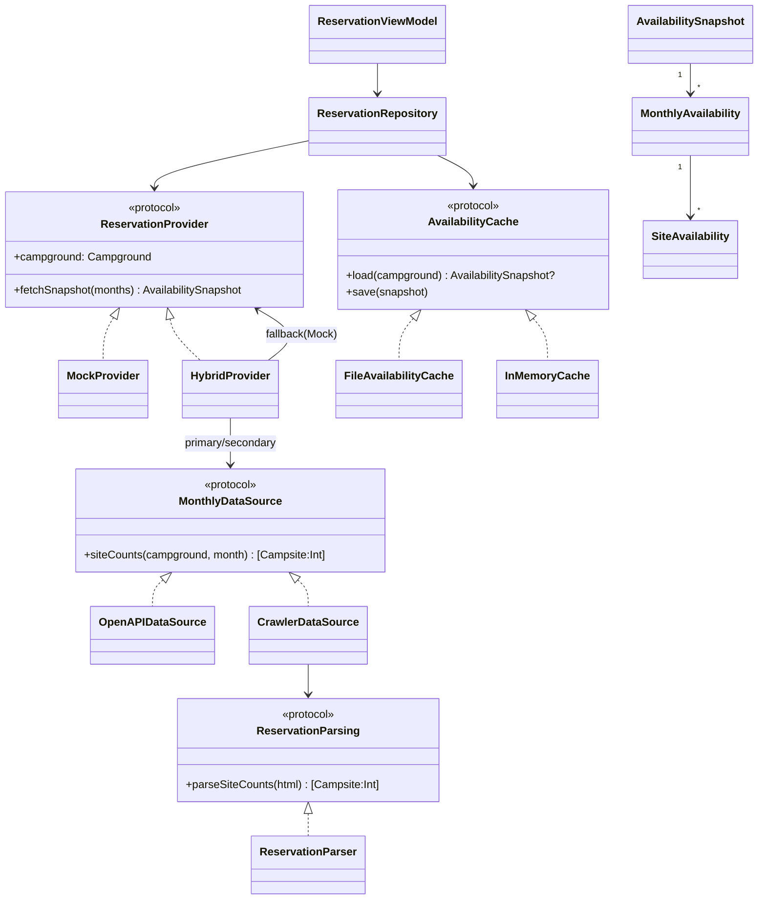
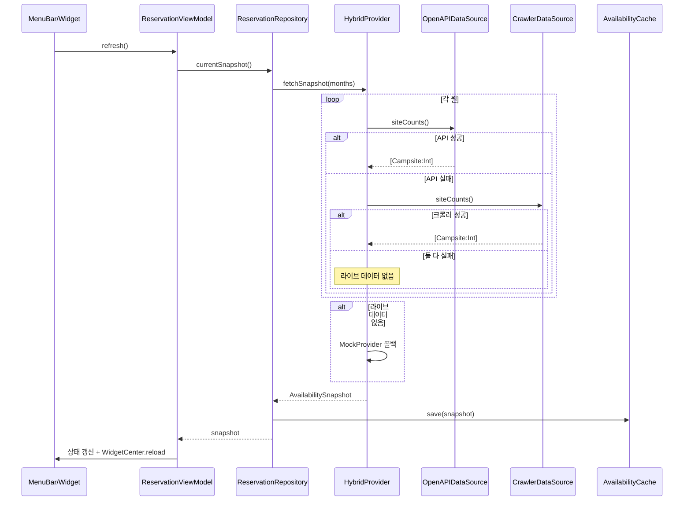
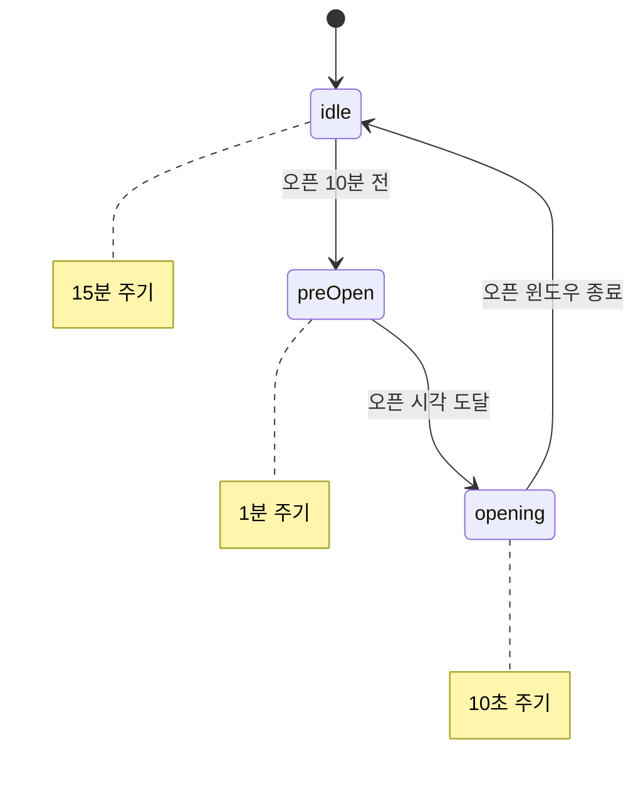

# 아키텍처

## 설계 목표

1. **데이터 소스 불확실성 격리** — 실제 서울 예약 API/HTML 구조를 몰라도
   앱 전체가 컴파일·실행·테스트되어야 한다. 모든 외부 의존은 프로토콜 뒤에 두고,
   최종 폴백으로 `MockProvider`를 둔다.
2. **UI-무관 코어** — `CampingCore`는 SwiftUI/WidgetKit에 의존하지 않아
   커맨드라인(`swift test`)만으로 검증 가능하다.
3. **앱·위젯 공유** — App Group 파일 캐시로 위젯이 앱의 최신 스냅샷을 읽는다.

## 레이어

| 레이어 | 구성요소 | 책임 |
|--------|----------|------|
| UI | `MenuBarView`, `ContentView`, `CalendarView`, `CampingWidget` | 렌더링 |
| ViewModel | `ReservationViewModel` | 상태 보관, 새로고침, 위젯 리로드 |
| Domain/저장소 | `ReservationRepository` | Provider+Cache 오케스트레이션 |
| Provider | `HybridProvider`, `MockProvider` | 스냅샷 조립 |
| DataSource | `OpenAPIDataSource`, `CrawlerDataSource` | 원시 수집 |
| 파싱 | `ReservationParser` | HTML → 사이트별 수량 |
| 저장 | `AvailabilityCache`(File/InMemory) | 스냅샷 캐시 |
| 스케줄 | `AdaptivePoller` | 폴링 주기 계산 |

## 클래스 다이어그램

## 시퀀스: 새로고침

## 적응형 폴링 상태

## 확장 지점 (Seam)

- **실제 API**: `OpenAPIDataSource.siteCounts()`의 TODO 구현
- **실제 크롤러**: `crawler/crawl.mjs`의 `crawlReal()` + `CrawlerDataSource(htmlProvider:)` 주입
- **SwiftData 캐시**: `AvailabilityCache` 새 구현으로 교체
- **다중 캠핑장**: `Campground` case별 Provider 등록
